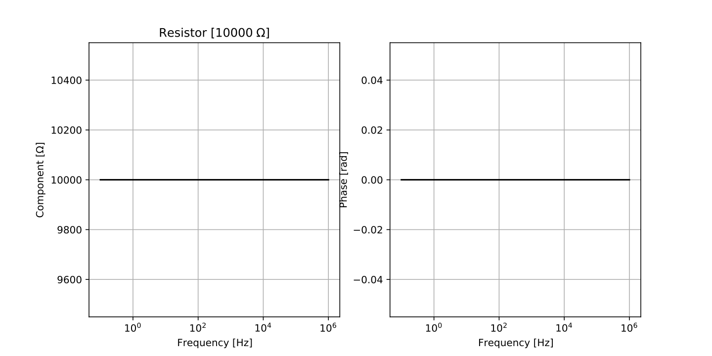
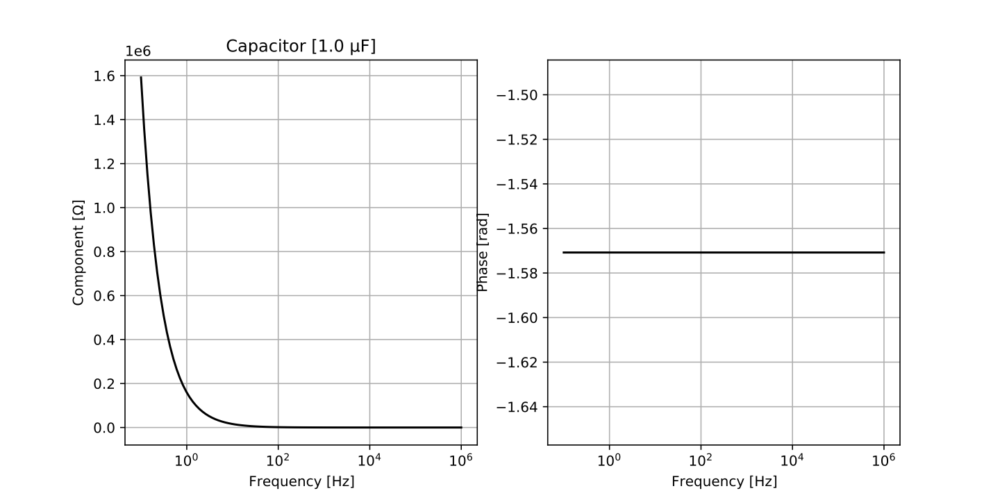
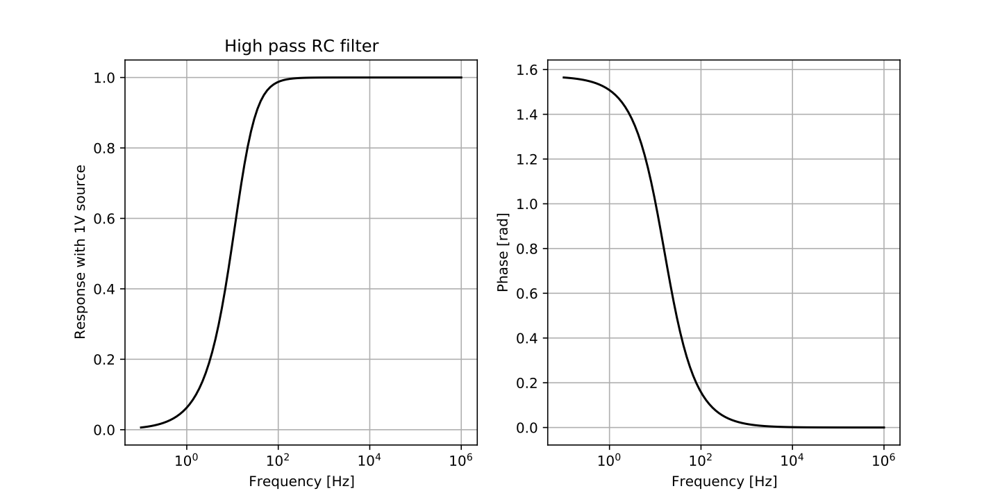
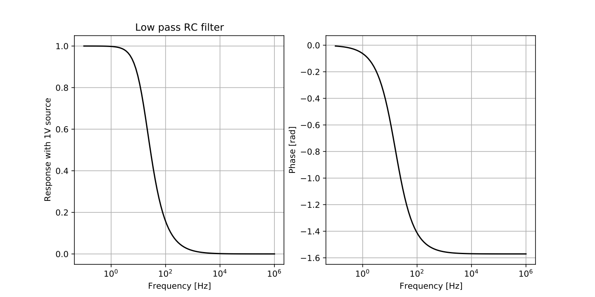

# Circuits

A small script to explore the frequency dependence of components: resistors, capacitors and inductors, in series or in parallel.

Download and then run either the main fiile or the test file:

```
python component.py
```

or 

```
python testsCircuits.py
```









